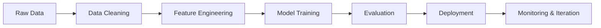

<h1 align="center">Hi 👋, I'm Hima Varshini</h1>

<h3 align="center">
AI & Data Engineer building intelligent systems with data, cloud, and machine learning
</h3>

I enjoy turning research ideas into practical, production-ready solutions across AI, data engineering, and cloud systems.

## 🎯 What I Build

- Intelligent systems that connect data, models, and users in useful ways
- Machine learning workflows that move from notebooks to deployable products
- Data-driven applications with clean architecture and practical impact
- AI experiences that are understandable, efficient, and polished

## 🧭 Workflow

## 👩‍💻 About Me

- 🎓 Final-year Computer Science and Artificial Intelligence student
- 💡 Focused on AI, data engineering, and cloud computing
- 🚀 Building intelligent applications with machine learning and scalable data systems
- 🌱 Currently exploring LLMs, Apache Spark, Kafka, and MLOps
- 🤝 Open to AI Engineer and Data Engineer opportunities
- 📖 Always learning and experimenting with new tools and ideas

## ✨ Highlights

- ⚡ End-to-end problem solving from data preparation to deployment
- 🧠 Strong interest in applied ML, NLP, computer vision, and GenAI
- 🛠️ Comfortable building with Python, Java, and modern web technologies
- ☁️ Interested in production systems, cloud workflows, and scalable architecture
- 🎯 Focused on creating projects that are useful, polished, and easy to explain

## 🔥 Current Focus

<table>
<tr>
<td width="50%" valign="top">

### Research + Build

- Historical script recognition with deep learning
- Dementia detection from speech signals
- LLM-driven exploration and experimentation

</td>
<td width="50%" valign="top">

### Systems + Deployment

- Scalable data pipelines and automation
- Cloud-ready ML workflows and MLOps basics
- Clean APIs and production-minded application design

</td>
</tr>
</table>

## 🚀 Currently Working On

- 📜 Historical script recognition using deep learning
- 🧠 Dementia Detection from Speech
- 📊 AI-powered job recommendation platform
- 🤝 Open Source & Personal Branding

## 🏆 Featured Work

- **Historical Script Recognition** - deep learning model for identifying historical handwritten scripts
- **Dementia Detection from Speech** - ML pipeline focused on speech-based health signals
- **AI Job Recommendation Platform** - intelligent matching system for career guidance

## 🧰 Tech Stack at a Glance

<table>
<tr>
<td valign="top" width="33%">

### Languages

</td>
<td valign="top" width="33%">

### AI / Data

Scikit-learn • Hugging Face Transformers • Apache Spark • Kafka

</td>
<td valign="top" width="33%">

### Cloud / Tools

</td>
</tr>
</table>

## 🔬 Research Interests

- 🤖 Artificial Intelligence
- 📊 Data Engineering
- ☁️ Cloud Computing
- 🧠 Deep Learning
- 💬 Natural Language Processing
- 📜 Computer Vision
- 📚 Machine Learning
- Generative AI

## 📈 GitHub Activity

## 🌱 Currently Learning

- Large language model workflows and prompt-driven applications
- Distributed data processing and pipeline orchestration
- Better deployment practices for ML systems
- Ways to make research projects more polished and production-ready

## 💬 Philosophy

<i>Build practical AI systems, ship with clarity, and keep learning in public.</i>

Thanks for visiting my profile.

## 🤝 Let’s Connect

I’m always open to collaboration on AI, data engineering, research-to-product ideas, and meaningful technical projects.

